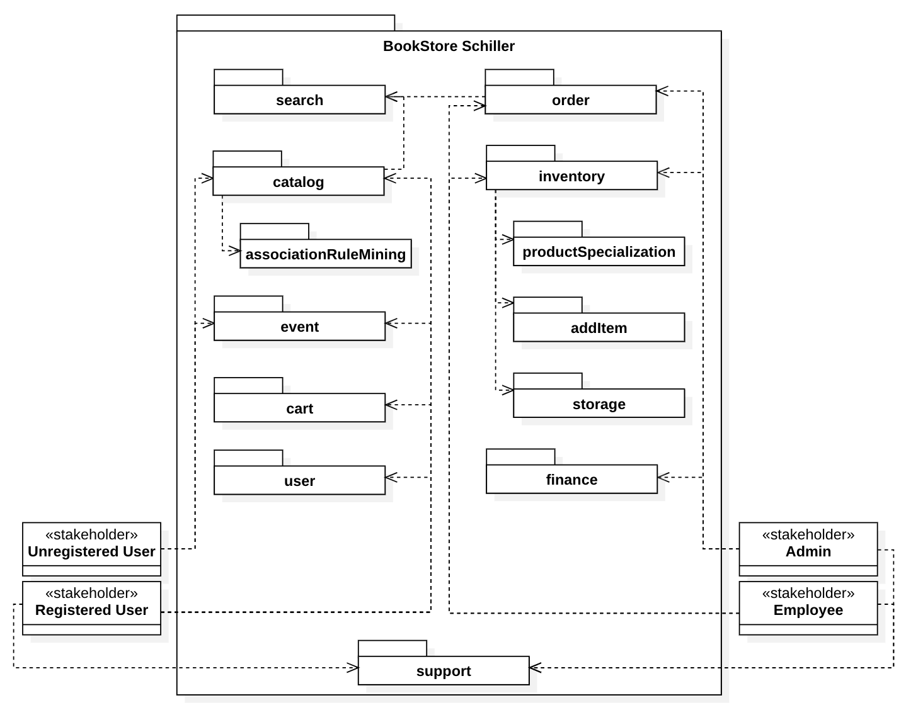
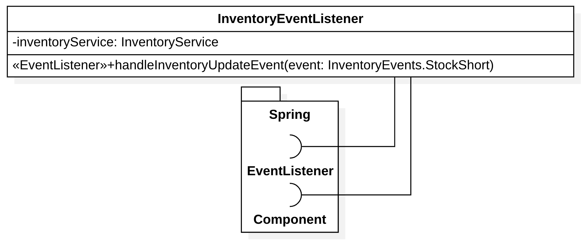
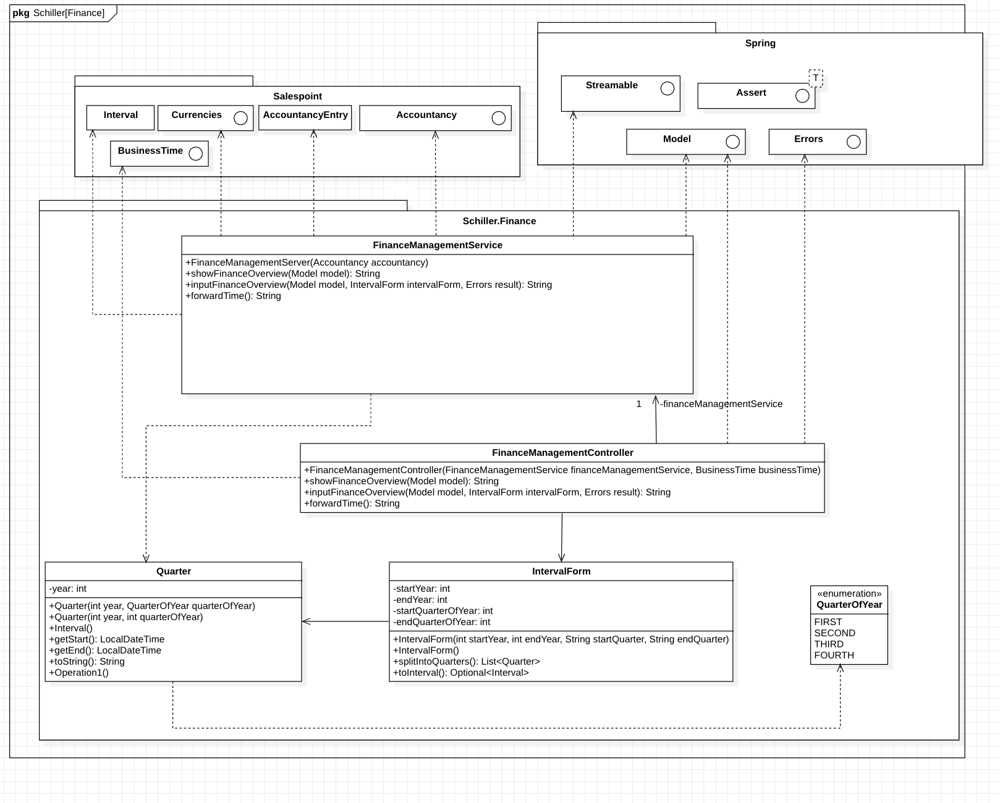

// Settings
:toc: macro
:!toc-title:

[options="header"]
[cols="1, 3, 3"]
|===
|Version | Edit Date   | Author
|...	| ... | ...
|===

= Developer Documentation

== 0. Table of Contents
toc::[]

== 1. Introduction and Goals
=== 1.1. Task Definition

To expand its business model, the Bookstore Schiller needs a web application for selling and managing books. However, the managing director and her colleagues still have some further ideas.

In addition to user management, the application also requires item management. For each book, at least the author, the publisher, the ISBN, a short description of the contents, and an image of the book volume must be saved. The books in the Bookstore Schiller are divided by genre into the categories Fiction, Non-Fiction, Entertainment and Self Help. A possibility to add and edit genres later is desirable. The managing director is also thinking about offering other items such as merchandise or calendars. It is desirable to be able to add categories afterwards so that new items can be continually added to the range. There are no subcategories. The idea is that there are several general categories, such as books, calendars, and merchandise. Items can be assigned to multiple categories. If the store decides to also offer postcards, for example, this category should be able to be added dynamically at runtime. After adding the category, it should of course also be possible to assign the article to this category when adding new articles. Categories should describe attributes of the items. New categories should be able to be added to the administration system by both admins and employees.

Given the variety of products on offer, the admin should be provided with an inventory management system. An interface or an import/export mechanism for item management, e.g. for mass updates, is not required. The inventory is entered manually by employees. New books and goods are ordered outside of the system being implemented. Once the goods have arrived, the new inventory level should be entered using a form. The overview should be able to be filtered/sorted according to existing quantities so that employees can see what needs to be reordered.

The user administration should provide the most important information (name, identification number, delivery address, orders, etc.) and also offer the option of processing this data. Registered customers are therefore able to change their most important information, such as address and contact options. Within a user administration, admins should have the opportunity to add, edit and remove new employees. When it comes to managing customers, not only the admin, but also other employees have access rights so that they can also view user profiles. Registration should be open to everyone, i.e. registration can be done proactively by the customer and without the supervision of an employee. However, expectations regarding the security of user profiles must be taken into account. Therefore, when a new customer registers, their password is checked based on various security criteria. This results in the following roles: Admin, Employee, Unregistered User and Registered User.

Registered Users order themselves using the shopping cart and select how they want to pay. After payment and shipping or collection, the order is completed. Payment by invoice and cash are sufficient, no further integration is necessary. When paying by invoice, it is important that open payments can be displayed in the employee view and can be set to paid so that employees know what still needs to be sent or picked up. In order to maintain an overview of order and payment processing, employees at the Bookstore Schiller should be able to see the status of each order in a summarized overview. For example, successful shipping and successful payment can be checked and recorded. For online orders, the items sold still need to be shipped. The employees do this manually after receipt of payment and mark the order accordingly.

As an additional feature, the Bookstore Schiller would like to have a calendar on the homepage that lists the weekly readings that take place in the bookstore's rooms. There should also be an overview page with details for each event. Users can book to reserve a place for a reading if they are already registered at the Bookstore Schiller. Users should also be able to manage their reservation, e.g. cancel or change it. The following information should be displayed for each event on the overview page: location, time, title, and description. Employees should also be able to edit and delete the event. Another essential piece of information for every event is the maximum number of participants, which should be stored separately from the room, as different events require or prefer different capacities, regardless of the room. When the admin creates events, the maximum capacity can also be specified in addition to the location.

=== 1.2. Quality Demands

The following table shows what quality demands have to be fulfilled to which extent.
The first column lists the quality demands, while in the following columns an "x" is used to mark the priority.
The assigned priority has to be considered in the formulation of the concrete non-functional requirements.

1 = Not Important ..
5 = Very Important
[options="header", cols="3h, ^1, ^1, ^1, ^1, ^1"]
|===
|Quality Demand           | 1 | 2 | 3 | 4 | 5
|Maintainability          |   |   |   | x |
|Usability                |   |   |   | x |
|Security                 |   |   |   |   | x
|===

== 2. Constraints
=== 2.1. Hardware Specifications
A list of necessary devices / hardware to run and use the application.

* Server
* Computer
* Keyboard
* Mouse

=== 2.2. Software Specifications
A list of necessary software to run and use the application.

It's highly recommended to use the following(or newer) Java version:

* Java 17.0.4.1

The following (or newer) browser versions are necessary to use the application:

* Internet Explorer / Edge 10.0
* Firefox 92.0.1+
* Google Chrome 94.0.4606+
* Safari 5.1.7+

=== 2.3. Product Usage
This section is going to give an overview of how the product is intended to be used upon completion and under which circumstances.

The system is going to be used as a web shop by the Bookstore Schiller to sell books and merchandise.
The software is supposed to run on a server and be available through the internet (via a browser) to interested customers 24/7.

The primary user of the software is an customer, who supposedly knows typical website navigation schemas, as well as administrators (Boss), who do not necessarily have a technical background.

The system shall only need minimal maintenance and new features will be rolled out upon request as the students of group 32 have to satisfy the needs of their next customer. Any data shall be stored persistently in a database and be accessible through the application (e.g. no SQL knowledge should be required for a boss).

== 3. Context and Scope
=== 3.1. Context Diagram

A context diagram provides a high-level visual representation of a system's architecture and its interaction with external entities or actors. It's primarily used in the early stages of software development to help stakeholders, including those without a technical background, understand the scope and boundaries of a system. By depicting the system as a single entity and showcasing its interactions with external actors, the context diagram helps in setting clear expectations and reducing potential misunderstandings.

*System Representation:* The main system is represented by the large rectangle labeled "Bookstore SCHILLER (from Bookstore SCHILLER)." This is the core of the software solution we are developing.

*External Entities/Actors:* Surrounding the main system, we see various external entities that interact with the system. These are:

- *User:* Represents individuals or other systems that will be using the bookstore website. User encapsulates users who interact with the website for various reasons or our staff.
- *Unregistered User:* Unauthenticated Users who use the bookstore. These are visitors who use our website.
- *Registered User:* Users who have been authenticated and therefore have a registered account. They have access to further functionalities such as purchasing items, for example.
- *Admin:* Represents users with higher privileges or access levels, responsible for managing or overseeing the system.
- *Employee:* Represents staff members or individuals responsible for day-to-day operations or tasks within the system.

image::models/analysis/ContextDiagramOOA.png[Context Diagram, 100%, 100%, pdfwidth=100%, title= "Context Diagram", align=center]

== 4. Solution Strategy
=== 4.1. Quality Demand Fulfillment
[options="header"]
|===
|Quality Demand |Solution approach

|Maintainability a|
* *Modularity* Application is composed of discrete, loosely coupled components. According to the principles of low coupling, high cohesion.
* *Reusability* Components are designed for reuse in different parts of the application or in different projects. 
* *Modifiability* The application is easy to modify and extend, with minimal risk of introducing errors.

|Usability a|
* *Error Handling* The system provides clear error indication to the user. For example, when she or he enters the wrong credentials.
* *User Interface* The interface is aesthetically pleasing and engaging for the user.
* *User Experience* The system is intuitive, easy to navigate and provides relevant context to the user.  
* *Accessibility* The system is accessible to users with visual impairements, by making use of various images, enlarged fonts and color contrasting.

|Security a|
* *Confidentiality* Ensure that only data can be only accessed by people who are authorized to access them. This can be realized with _Spring Security_ and _Thymeleaf_ (`sec:authorize` - tag).
* *Integrity* Prevent unauthorized modification of data. This can be realized with _Spring Security_ (`@PreAuthorize` - annotation).
* *Accountability* All user actions are logged, ensuring traceability and accountability.

|===

=== 4.2. Software Architecture

=== 4.3. Architecture decisions

==== 4.3.1. Design Patterns
* Spring MVC

==== 4.3.2. Persistence
The application uses *Hibernate annotation based mapping* to map Java classes to database tables. As a database, *H2* is used.
The persistence is deactivated by default. To activate persistence storage, the following two lines in the file _application.properties_ have to be uncommented:
....
# spring.datasource.url=jdbc:h2:./db/schiller
# spring.jpa.hibernate.ddl-auto=update
....

==== 4.3.3. User Interface
[[UserInterface.png]]

[small]_Note: The blue boxes display a HTML-Template. The white boxes within the templates represent buttons, which redirect to the other templates._
[small]_Note: For readability reasons not every single template has been included, but rather the most important ones to get an overview of the website._

==== 4.3.4. Admin Interface
[[AdminInterface.png]]

[small]_Note: The blue boxes display a HTML-Template. The white boxes within the templates represent buttons, which redirect to the other templates._
[small]_Note: For readability reasons not every single template has been included, but rather the most important ones to get an overview of the website._

=== 4.4. Use of external frameworks

[options="header"]
|===
|External package |Used by |Why
|org.springframework.boot a|
* schiller
| Simple configuration of Spring application
|org.springframework.web a|
* schiller.inventory
* schiller.order
* schiller.user
* schiller.catalog
* schiller.user
* schiller.support
* schiller.search
| Application should be provided as a static website
|org.springframework.security a|
* schiller.order
* schiller.user
| Security features for application and authorization of website access
|org.springframework.data a|
* schiller.inventory
* schiller.order
* schiller.user
* schiller.support
| JPA connection utility to the database layer
|org.springframework.ui a|
* schiller.order
* schiller.catalog
* schiller.user
* schiller.support
* schiller.search
| Interaction between code and html
|org.springframework.util a|
* schiller.order
* schiller.catalog
* schiller.user
* schiller.support
* schiller.search
| Argument checking with Assert
|org.salespointframework.stereotype a|
* schiller.order
* schiller.user
* schiller.catalog
* schiller.user
* schiller.support
* schiller.search
| Annotations denoting the roles of types or methods in the overall architecture
|org.springframework.beans a|
* schiller.order
* schiller.support
| Needed for Autowired annotation in OrderManagementService and SupportController
|org.salespointframework a|
* schiller.inventory
* schiller.order
* schiller.user
* schiller.catalog
* schiller.support
* schiller.search
| Reuse of SalesPoints POS functionality

|===

== 5. Building block view

=== 5.1. Schiller

|=== 
|Class/Enumeration |Description
|Schiller|The central application class to configure the Spring container and run the application
|SchillerWebConfiguration|Configuration class to route `/login` directly to the `login.html` template
|WebSecurityConfiguration|Configuration class to set up basic security and login/logout options
|===

=== 5.2. Order

[options="header"]

|===
|Class/Enumeration |Description
|OrderManagementService |Logic component for order management
|OrderManagementController |Frontend controller for order management
|OrderDataInitializer |Initializes default orders for development
|SchillerOrder |Class to extend Salespoint.Order by a DeliveryMethod
|SchillerOrderRepository |A repository interface to manage SchillerOrder instances
|DeliveryMethod |An abstract class as a tamplate for delivery methods
|Pickup |A DeliveryMethod with a boolean which shows whether the order has been picked up
|Delivery |A DeliveryMethod with a shipping-address and a delivery-status
|DeliveryStatus |An Enum different statuses
|Bill |A Class that extends Salespoint.PaymentMethod
|SearchTerm |A Class to save a searchterm
|===

=== 5.3. Catalog

[options="header"]
|===
|Class/Enumeration |Description
|Catalog Controller |A Spring MVC Controller to handle request to show ``Book``s, ``ProductExtension``s and create their ``Comment``s
|CatalogDataInitializer |An Implementation of the DataInitializer to create dummy ``Book``s on application startup
|CatalogService | A Spring Service that handles the background functionality of the CatalogController
|CommentAndRating | Describes the payload to be expected to add a comment
|===

=== 5.4. User

[options="header"]
|=== 
|Class/Enumeration |Description
|User |Custom class to extend the Salespoint-UserAccount with an identifier
|UserController |A Spring MVC Controller to handle requests to register, update and show users
|UserDataInitializer |An implementation of the DataInitializer to create some already existing customers, employees and a boss on application startup
|UserManagement |Service class to manage users
|UserRepository |A repository interface to manage User instances
|RegistrationForm |An interface to validate and accept the user input of the registration formular
|EmployeeForm |An interface to validate and accept the input of the employee-registration formular
|Customer |A custom class to extend the User class with an address
|===

=== 5.5. Inventory

==== 5.5.1. AddItem

[options="header"]
|===
|Class/Enumeration | Description
|BookForm | A form that will create a new ``Book``
|ProductExtensionForm | A form that will create a new ``ProductExtension``
|GenreForm | A form that will create a new ``Genre``
|CategoryForm | A form that will create a new ``Category``
|===

==== 5.5.2. ProductSpezialization

[options="header"]
|===
|Class/Enumeration | Description
|ProductSpecialization | A Spring Entity to generalize the used Products ``Book`` and ``ProductExtension``
for their common attribute ``comments``
|===

===== 5.5.2.1 Book

[options="header"]
|===
|Class/Enumeration | Description
|Book | Class to describe ``Book``s as a product of the Schiller Bookstore
|BookCatalog | An extension of Salespoint.Catalog to add bookstore specific queries
|===

====== 5.5.2.1.1 Genre

[options="header"]
|===
|Class/Enumeration | Description
|Genre | A class to describe the Genre a ``Book`` can have. ``Book``s
have multiple ``Genre``s
|GenreDataInitializer | An Implementation of the DataInitializer to create dummy ``Genre``s on application startup
|GenreRepository | An Implementation of the CrudRepository to save the entities of type ``Genre``
|===

====== 5.5.2.1.2 Author

[options="header"]
|===
|Class/Enumeration | Description
| Author | A class to represent the author of a ``Book``. ``Book``s
only have a single ``Author``.
| AuthorRepository | An Implementation of the CrudRepository to save entities of type ``Author``
| AuthorService | A Spring Service to handle and check a request before the ``AuthorRepository`` gets involved.
|===

===== 5.5.2.2 ProductExtension

[options="header"]
|===
|Class/Enumeration | Description
| ProductExtension | Class to describe ``ProductExtension``s as a product of Schiller Bookstore
| ProductExtensionCatalog | An extension of Salespoint.Catalog to add bookstore specific queries
|===

====== 5.5.2.2.1 Category

[options="header"]
|===
|Class/Enumeration | Description
| Category | A class to describe the kind of product a ``ProductExtension`` will be mapped to.
Therefore, a ``Category`` has many ``ProductExtensions`` and models a similarity of ``ProductExtension``s.
| CategoryRepository | An Implementation of the CrudRepository to save entities of type ``Category``
|===

===== 5.5.2.3 Comment

[options="header"]
|===
| Class/Enumeration | Description
|Comment | A comment which can be written for a ``ProductSpecialization``
|===

==== 5.5.3. Storage

[options="header"]

[options="header"]

[options="header"]

[options="header"]

|===
|Class/Enum |Description
|FileSystemStorageService| The class `FileSystemStorageService` is a Spring service that provides functionalities for file storage, including storing, loading, and deleting files, as well as initializing storage and handling mock images.
|FileUploadController| The `FileUploadController` class is a Spring MVC controller managing file upload operations, including listing uploaded files, serving individual files, handling file uploads, and managing file not found exceptions.
|StorageException| The `StorageException` class is a custom exception type extending `RuntimeException`, used to handle storage-related errors with optional cause information.
|StorageFileNotFoundException| The `StorageFileNotFoundException` class is a specialized `StorageException` used specifically for handling file-not-found scenarios.
|StorageProperties| The `StorageProperties` class configures storage properties, particularly root and mock locations for file storage, using Spring's `ConfigurationProperties`.
|StorageService| The `StorageService` interface defines methods for initializing storage, storing, loading, and deleting files, as well as additional functionalities like copying mock images and converting resources to `MultipartFile`.

|===

==== 5.5.4. Core

[options="header"]

[options="header"]

[options="header"]

[options="header"]

[options="header"]

[options="header"]

|===
|Class/Enum |Description
|InventoryInitializer | The `InventoryInitializer` class is a Spring component responsible for initializing the inventory with default quantities for books.
|InventoryConfiguration | The `InventoryConfiguration` class is a Spring configuration class responsible for configuring inventory-related settings, injected from an external configuration property list, stored in `application.properties`.
|InventoryController | The `InventoryController` class is a Spring MVC controller responsible for handling inventory-related requests.
|InventoryEventListener | The InventoryEventListener class is a Spring `Component` designed to listen for inventory-related events, specifically the `InventoryEvents.StockShort` event.
|InventoryService | The `InventoryService` class provides functionality related to inventory management. It is annotated with `@Service`, as it provides the needed logic for inventory management.
|===

The decision to adopt the UniqueInventory model in our Java Spring Application for the bookstore stems from the need for a simple and intuitive inventory management system. By opting for a one-to-one relationship between products and InventoryItems, mirroring a centralized warehouse approach, we aim to streamline the understanding of stock levels. The Quantity attribute in the InventoryItem directly corresponds to the available items for a specific product, providing clarity and simplicity in inventory tracking.

In contrast, the MultiInventory alternative, accommodating a one-to-many relationship, introduces complexity, particularly in scenarios involving multiple warehouses. While this model might be suitable for diverse warehousing setups, its implementation complicates processes like order completion. Unlike the UniqueInventory, the MultiInventoryItems are not automatically adjusted upon order completion, necessitating additional logic to handle quantity reduction, unnecessary for a single bookstore.

=== 5.6. AssociationRuleMining

[options="header"]

[options="header"]

[options="header"]

[options="header"]

[options="header"]

[options="header"]

[options="header"]

[options="header"]

|===
|Class/Enum |Description
|AprioriFrequentItemsetGenerator| The `AprioriFrequentItemsetGenerator` class is a data mining utility implementing the Apriori algorithm to generate frequent itemsets from transaction data based on a given minimum support threshold.
|AssociationRule| The `AssociationRule` class represents an association rule in data mining, consisting of an antecedent and consequent set of `ProductIdentifiers` and a confidence value, used for rule analysis and representation.
|AssociationRuleDataInitializer| The `AssociationRuleDataInitializer` class is a Spring component that initializes data for association rule mining by processing orders and updating item sets and association rules through the `AssociationRuleMiningService`.
|AssociationRuleGenerator| The `AssociationRuleGenerator` class generates association rules from frequent itemsets using the Apriori algorithm, ensuring these rules meet a specified minimum confidence threshold.
|AssociationRuleMiningConfiguration| The `AssociationRuleMiningConfiguration` class is a configuration class that uses Spring's `@Configuration` to set up values for minimum support and confidence thresholds for association rule mining.
|AssociationRuleMiningService| The `AssociationRuleMiningService` class is a service that manages association rule mining, updating itemsets and association rules based on inventory data, and providing associated product recommendations.
|FrequentItemsetData| The `FrequentItemsetData` class encapsulates data about frequent itemsets, including the itemsets themselves, their support counts, minimum support threshold, and the total number of transactions involved.

|===

=== 5.7 Support System

[options="header"]
|=== 
|Class/Enumeration |Description
|Issue |A chat/ticket Registered Users/ Customers can create to get in contact with admins
|SupportController |A Spring MVC Controller to handle requests pertaining to communication between Customers and Admins
|IssueManagement |Service class to manage Issues
|IssueRepository |A repository interface to manage Issue instances
|Message |A text that can be sent from Customer to Admin and the other way around
|MessageForm |An interface to validate and accept the message input
|===

=== 5.8 Finance

[options="header"]
|===
|Class/Enumeration |Description
|FinanceManagementController |A Spring MVC Controller that handles HTTP GET and POST requests for the finance section of the application. It is responsible for presenting financial data such as turnover and processing interval forms for financial reporting.
|FinanceManagementService |A service class that provides business logic and data access to financial information. It interacts with the accountancy subsystem to calculate turnover, both overall and per specified time intervals.
|IntervalForm |A class that encapsulates the data from an interval form submission. It includes the start and end year, and quarters, and provides methods to convert form data into a list of Quarter objects and an Interval.
|QuarterOfYear |An enumeration that represents the four quarters of a year. It includes methods to convert strings and integers to QuarterOfYear values, check ordering, and convert to integers.
|Quarter |A class that represents a specific quarter of a specific year. It provides methods to convert a quarter into an Interval, and obtain the start and end LocalDateTime of the quarter. It implements Comparable to allow sorting and comparison.
|===

=== 5.9 Search

[options="header"]
|===
|Class/Enumeration | Description
|SearchController |A Spring MVC Controller to handle request to show for searched ``Book``s, ``ProductExtension``s and ``Order``s
|SearchService | A Spring Service that handles the background functionality of the SearchController
|===

=== 5.8. Traceability between Analysis- and Design Model

[options="header"]
|===
|Class/Enumeration (Analysis) |Class/Enumeration (Design)
|Schiller Bookstore |schiller.Schiller
|User, RegisteredUser |salespointframework.UserAccount
|Customer |schiller.user.User +
salespointframework.UserAccount +
salespointframework.Role
|Employee |salespointframework.Role +
salespointframework.UserAccount
|Admin/Boss |salespointframework.Role +
salespointframework.UserAccount
|Product | schiller.inventory.productSpecialization.ProductSpecialization +
schiller.inventory.productSpecialization.book.Book +
schiller.inventory.productSpecialization.productExtension.ProductExtension
|MiscProduct |not yet implemented
|ProductCategory |schiller.inventory.productSpecialization.productExtension.category.Category
|ProductImage |java.String
|Book |schiller.inventory.productSpecialization.book.Book
|Author |schiller.inventory.productSpecialization.book.author.Author
|Genre |schiller.inventory.productSpecialization.genre.Genre
|Calendar |not yet implemented
|Event |not yet implemented
|Reading |not yet implemented
|Catalog | salespointframework.catalog + schiller.catalog
|Inventory |salespoint.UniqueInventory<UniqueInventoryItem>
|InventoryItem |salespoint.UniqueInventoryItem
|Cart |salespoint.Cart
|Item |salespoint.CartItem
|Order |salespoint.Order
|PaymentStatus |salespoint.OrderStatus
|PickupOrder |schiller.order.Pickup
|DeliveryOrder |schiller.order.DeliveryOrder
|DeliveryStatus |schiller.order.DeliveryOrder.DeliveryStatus

|===

== 6. Runtime view
* Showcasing of component interaction using sequence diagrams (only the most relevant interactions are modeled)

=== 6.1. Order

=== 6.2. User

=== 6.3. Support

=== 6.4. Inventory

=== 6.5 Finance

