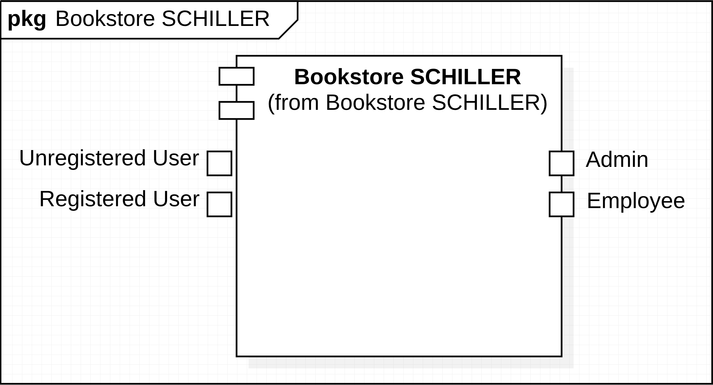
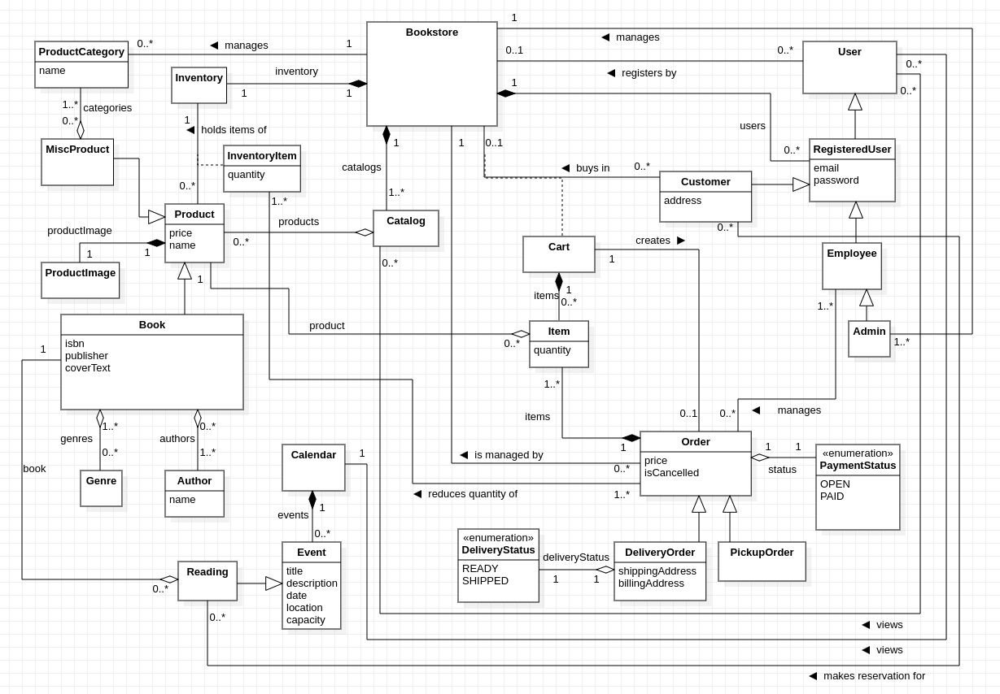

// Settings
:toc: macro
:!toc-title:

= Pflichtenheft
:project_name: Projektname
== __{project_name}__

[options="header"]
[cols="1, 1, 1, 1, 4"]
|===
|Version | Status      | Edit Date   | Author(s) |  Note
|0.1     | Done   | 1.11.2023        | Team swt23w32       | Initial Version
|===

== Table of Contents
toc::[]

== Summary

A specification book is a critical document in the software development process that outlines the requirements, features, and functionalities of a project. It serves as a blueprint for the project, providing clear guidance to developers and other stakeholders on what needs to be built. Its structure includes the following sections:

* Task and Objective: This section details the project's scope, requirements, and goals. It includes information about user and item management, user roles, payment methods, inventory management, and event management.
* Product Usage: Describes how the software will be used, who the primary users are, and the browsers it should be compatible with.
* Stakeholders: Lists the key stakeholders involved in the project, their priorities, and high-level goals.
* System Boundary and Top-Level Architecture: Provides a context diagram and top-level architecture of the system, showing its main components and their interactions.
* Use-Cases: Describes the main use cases of the system, the actors involved, and their interactions.
* Functional Requirements: Lists the essential functional requirements, including user authentication, registration, inventory management, cart functionality, schiller.order processing, and event management.
* Non-Functional Requirements: Describes the non-functional requirements, such as availability, usability, and security.
* GUI Prototype: Offers visual representations of the user interface, including screenshots and mockups.
* Data Model: Presents a class diagram of the system's data model, including classes and enumerations that represent various aspects of the project.
* Acceptance Test Cases: Provides test cases to validate the system's functionality, including searching for items, making purchases, and handling different scenarios.

The specification book serves as a comprehensive guide for both the development team and stakeholders, ensuring that everyone is on the same page regarding project requirements and expectations.

== Task and objective

To expand its business model, the Bookstore Schiller needs a web application for selling and managing books. However, the managing director and her colleagues still have some further ideas.

In addition to user management, the application also requires item management. For each book, at least the author, the publisher, the ISBN, a short description of the contents, and an image of the book volume must be saved. The books in the Bookstore Schiller are divided by genre into the categories Fiction, Non-Fiction, Entertainment and Self Help. A possibility to add and edit genres later is desirable. The managing director is also thinking about offering other items such as merchandise or calendars. It is desirable to be able to add categories afterwards so that new items can be continually added to the range. There are no subcategories. The idea is that there are several general categories, such as books, calendars, and merchandise. Items can be assigned to multiple categories. If the store decides to also offer postcards, for example, this category should be able to be added dynamically at runtime. After adding the category, it should of course also be possible to assign the article to this category when adding new articles. Categories should describe attributes of the items. New categories should be able to be added to the administration system by both admins and employees.

Given the variety of products on offer, the admin should be provided with an inventory management system. An interface or an import/export mechanism for item management, e.g. for mass updates, is not required. The inventory is entered manually by employees. New books and goods are ordered outside of the system being implemented. Once the goods have arrived, the new inventory level should be entered using a form. The overview should be able to be filtered/sorted according to existing quantities so that employees can see what needs to be reordered.

The user administration should provide the most important information (name, identification number, delivery address, orders, etc.) and also offer the option of processing this data. Registered customers are therefore able to change their most important information, such as address and contact options. Within a user administration, admins should have the opportunity to add, edit and remove new employees. When it comes to managing customers, not only the admin, but also other employees have access rights so that they can also view user profiles. Registration should be open to everyone, i.e. registration can be done proactively by the customer and without the supervision of an employee. However, expectations regarding the security of user profiles must be taken into account. Therefore, when a new customer registers, their password is checked based on various security criteria. This results in the following roles: Admin, Employee, Unregistered User and Registered User.

Registered Users schiller.order themselves using the shopping cart and select how they want to pay. After payment and shipping or collection, the schiller.order is completed. Payment by invoice and cash are sufficient, no further integration is necessary. When paying by invoice, it is important that open payments can be displayed in the employee view and can be set to paid so that employees know what still needs to be sent or picked up. In schiller.order to maintain an overview of schiller.order and payment processing, employees at the Bookstore Schiller should be able to see the status of each schiller.order in a summarized overview. For example, successful shipping and successful payment can be checked and recorded. For online orders, the items sold still need to be shipped. The employees do this manually after receipt of payment and mark the schiller.order accordingly.

As an additional feature, the Bookstore Schiller would like to have a calendar on the homepage that lists the weekly readings that take place in the bookstore's rooms. There should also be an overview page with details for each event. Users can book to reserve a place for a reading if they are already registered at the Bookstore Schiller. Users should also be able to manage their reservation, e.g. cancel or change it. The following information should be displayed for each event on the overview page: location, time, title, and description. Employees should also be able to edit and delete the event. Another essential piece of information for every event is the maximum number of participants, which should be stored separately from the room, as different events require or prefer different capacities, regardless of the room. When the admin creates events, the maximum capacity can also be specified in addition to the location.

== Product Usage

This section is going to give an overview of how the product is intended to be used upon completion and under which circumstances.

The system is going to be used as a web shop by Schiller to sell books, merchandise, calendars and to book events. The software is supposed to run on a server and be available through the internet (via a browser) to interested customers 24/7.

The system shall be accessible and visually optimized for the following desktop (and mobile if applicable) browsers:

Mozilla Firefox, version 92.0.1+

Google Chrome, version 94.0.4606+

Safari, version 5.1.7+

The primary user of the software is an customer, who supposedly knows typical website navigation schemas, as well as administrators (Boss), who do not necessarily have a technical background.

The system shall only need minimal maintenance and new features will be rolled out upon request as the students of group 32 have to satisfy the needs of their next customer. Any data shall be stored persistently in a database and be accessible through the application (e.g. no SQL knowledge should be required for a boss).

== Stakeholders
This section lists every group or individual (either real or juridical) that has an influence on the system requirements. In the table below, these stakeholders are listed, a priority is assigned (in case requirements conflict, this enables easier decisions), and their high-level goals are described.

Assigned priorities range from 1 (lowest priority) to 5 (highest priority).

[options="header", cols="2, ^1, 4, 4"]
|===
|Name
|Priority (1..5)
|Description
|Goals

|Bookstore Schiller
|5
|The main client for this project.
a|

- Increase in sales
- Automate processes
- User-friendly application
- Efficient inventory management

|Customers
|4
|Primary users of the application intended to generate revenue.
a|

- Good user experience
- Easy-to-browse catalog
- Quick schiller.order processing
- Participation in events

|Admins and Employees
|3
|Users who manage the application (e.g., overseeing all orders).
a|

- Ability to oversee all data in the system
- Managing processes and events
- Adding/Editing categories and items
- Monitoring open payments
|Developers
|2
|Individuals who either implement the application or are responsible for its maintenance later on.
a|

- Easily extendable application
- Low maintenance effort
- Good debugging mechanisms
|===

== System boundary and top-level architecture

=== Context Diagram
A context diagram provides a high-level visual representation of a system's architecture and its interaction with external entities or actors. It's primarily used in the early stages of software development to help stakeholders, including those without a technical background, understand the scope and boundaries of a system. By depicting the system as a single entity and showcasing its interactions with external actors, the context diagram helps in setting clear expectations and reducing potential misunderstandings.

*System Representation:* The main system is represented by the large rectangle labeled "Bookstore SCHILLER (from Bookstore SCHILLER)." This is the core of the software solution we are developing.

*External Entities/Actors:* Surrounding the main system, we see various external entities that interact with the system. These are:

- *Unregistered User:* Unauthenticated Users who use the bookstore. These are visitors who use our website.
- *Registered User:* Users who have been authenticated and therefore have a registered account. They have access to further functionalities such as purchasing items, for example.
- *Admin:* Represents users with higher privileges or access levels, responsible for managing or overseeing the system.
- *Employee:* Represents staff members or individuals responsible for day-to-day operations or tasks within the system.

In the example of the user, a deliberate distinction is made between registered and unregistered users. The “User” class can still be found as an auxiliary class in the data model.

, 100%, 100%, pdfwidth=100%, title= "Context Diagram", align=center]

=== Top-Level Architecture
In the realm of software development, the Top-Level Architecture serves as a high-level blueprint of the system, highlighting its principal components and their relationships. It performs several crucial functions:

*Holistic Overview:* This architecture provides stakeholders with a comprehensive overview of the system's structure without delving into intricate details.

*Component Interaction:* It demonstrates how different parts of the system communicate and interact with one another.

*Guidance for Developers:* It acts as a guide for the development team, helping them understand the primary building blocks they will work on and how they interconnect.

*Stakeholder Communication:* For non-technical stakeholders, the Top-Level Architecture simplifies the complex nature of the system into understandable chunks, allowing for informed decision-making.

Looking at the diagram, think of the "Bookstore SCHILLER" as a digital bookstore. Here's a breakdown of its architecture:

- *Catalog:* This is like the display shelves in a physical bookstore. It showcases the books and other items available for purchase.
- *Event Calendar:* Think of this as a calendar hanging in the store, informing you of upcoming book readings or other events at the bookstore.
- *Shopping Cart:* Just as you might use a cart to gather books in a physical store, this component allows users to collect and manage items they wish to purchase online.
- *Inventory Management:* Behind the scenes, this component keeps track of how many copies of each book are in stock, ensuring that the store doesn't sell more than it has.
- *Event Management:* This manages the logistics and details of the events advertised in the Event Calendar.
- *Order and Payment Processing:* Once you've chosen your books and are ready to make a purchase, this component handles the transaction, ensuring your payment is processed and the schiller.order is recorded. Furthermore, it allows employees to get an overview of all orders and their status.
- *User Management:* This is the bookstore's way of recognizing you. It manages user profiles, booked events, and purchase histories, much like a store loyalty program.

== Use-Cases

This section will give an overview of the use cases the system has to support. These use cases describe what functionality the system has to provide (mostly) from the client’s point of view and which actors are involved.

=== Actors

Actors are users of the system or neighboring systems who/which access it. The following table summarizes all actors of the system and provides a description of the actor. Abstract actors (i.e. an actor which groups other actors, written in italic) are used to generalize and group.

// See http://asciidoctor.org/docs/user-manual/#tables
[options="header"]
[cols="1,4"]
|===
|Name |Beschreibung
|_User_  |Representative for every person who interacts with the system, regardless if authenticated or not. This includes all the following actors in the table.
|_Customer_ | Representative for every person interacting with the bookstore website with the intent to purchase books and products or book events. Customer encapsulates both Registered Users and Unregistered Users.
|Unregistered User |Representative for a _Customer_ who has not yet been authenticated and therefore does not yet have a user account in the system.
|Registered User |Representative for _Customers_ who have been authenticated and therefore have a user account in the system.
|Admin |Representative for _Users_ who are registered and authenticated as "ADMIN". They are responsible for the administration of the application.
|Employee |Representative for _Users_ who are registered and authenticated as "EMPLOYEE". They serve the client by running the bookstore and therefore also have some administrative rights.
|===

=== Use-Cases Diagram

=== Use-Case Descriptions

This section describes the use cases shown in the use case diagram in detail.

[cols="1,4"]
|===
|Name |Login/Logout

|ID
|[[UC0010]]<<UC0010>>

|Description
|User can login in schiller.order to access further functionalities the website has to offer. This process is reversed by logging out.

|Actors
|User

|Trigger
|_Login_: User wants to access further functionalities by logging in +
_Logout_: User no longer needs extra functionalities

|Precondition(s)
|_Login_: User is not yet authenticated +
_Logout_: User is authenticated

|Essential Steps
|_Login_: +
1. User selects "Login" in the navigation bar +
2. User enters his credentials (email, password and address) +
3. User selects "Log in" button +
_Logout_: +
1. User selects "Log out" in the navigation bar +
2. User is unauthenticated and is shown the home screen

|Functional Requirements
|[[F0010]]<<F0010>>
|===

[cols="1,4"]
|===
|Name |Register

|ID
|[[UC0020]]<<UC0020>>

|Description
|An unauthenticated User can create a user account for themselves

|Actors
|Unregistered User

|Trigger
|Unregistered User wants to create a user account by selecting "Register" in the navigation bar

|Precondition(s)
|User has not been authenticated/ has not logged in

|Essential Steps
|1. Unauthenticated User selects "Register" button +
2. User enters his email and chosen password +
3. System checks and validates their credentials +
-> If accepted, user account is created with given credentials +
-> Otherwise error message is shown

|Functional Requirements
|[[F0020]]<<F0020>>, [[F0021]]<<F0021>>
|===

[cols="1,4"]
|===
|Name |Manage Account

|ID
|[[UC0030]]<<UC0030>>

|Description
|Users can manage their own user account

|Actors
|Registered Users

|Trigger
|User selects "My account" in the navigation bar

|Precondition(s)
|User is registered and logged-in

|Essential Steps
|1. User selects "My account" in the navigation bar +
2. Account details are displayed +
3. User can edit account details by selecting "Edit" button

|Functional Requirements
|[[F0030]]<<F0030>>, [[F0031]]<<F0031>>, [[F0032]]<<F0032>>, [[F0033]]<<F0033>>, [[F0010]]<<F0010>>
|===

[cols="1,4"]
|===
|Name |Manage Users

|ID
|[[UC0040]]<<UC0040>>

|Description
|Admins can view and manage/edit all user accounts

|Actors
|Admin

|Trigger
|Admin selects "User Management" in the navigation bar

|Precondition(s)
|User is authenticated as "ADMIN"

|Essential Steps
|1. Admin selects "User Management" in the navigation bar +
2. A complete list of all authenticated Users is shown (including ID, email and role) +
3. Admin can select button "Edit" to add users or edit existing users

|Functional Requirements
|[[F0040]]<<F0040>>

|===

[cols="1,4"]
|===
|Name |Browse Catalog

|ID
|[[UC0111]]<<UC0111>>

|Description
|All Users have access to the catalog, where they can view the bookstore's products by category

|Actors
|Unregistered User, Registered User

|Trigger
|User selects "Catalog" in the navigation bar

|Precondition(s)
| -

|Essential Steps
|1. User selects "Catalog" in the navigation bar +
2. Products are displayed by category (books by default)

|Functional Requirements
|[[F0111]]<<F0111>>
|===

[cols="1,4"]
|===
|Name |View Product Details

|ID
|[[UC0120]]<<UC0120>>

|Description
|User can view the details of a product by selecting it in the catalog

|Actors
|Unregistered User, Registered User

|Trigger
|User is viewing the catalog and selects one of the products by clicking on it

|Precondition(s)
|User is viewing the catalog

|Essential Steps
|1. User selects one of the catalog's products +
2. Product details are shown

|Functional Requirements
|[[F0120]]<<F0120>>
|===

[cols="1,4"]
|===
|Name |Search Product

|ID
|[[UC0130]]<<UC0130>>

|Description
|Users can search products by their name in schiller.order to see if they are available at the bookstore

|Actors
|Unregistered User, Registered User

|Trigger
|User selects "Search" button

|Precondition(s)
|User is within the catalog section

|Essential Steps
|
1. User is within the catalog section +
2. User selects "Search" button +
3. User inputs the product name they are looking for +
4. System checks whether there are products containing the given input in their name +
5. These products are then displayed +

|Functional Requirements
|[[F0130]]<<F0130>>

|===

[cols="1,4"]
|===
|Name |Add Product to Cart

|ID
|[[UC0201]]<<UC0201>>

|Description
|User can add a product (in the chosen quantity) to their cart

|Actors
|Unregistered User, Registered User

|Trigger
|User is viewing the details of a product and decides to add it to their cart

|Precondition(s)
|User is viewing the product details

|Essential Steps
|1. User selects "Add to Cart" +
2. User selects quantity +
3. Product is added to Cart in the given quantity

|Funtional Requirements
|[[F0201]]<<F0201>>, [[F0010]]<<F0010>>

|===

[cols="1,4"]
|===
|Name |View Cart

|ID
|[[UC0210]]<<UC0210>>

|Description
|Users can view the products in their cart and the total price

|Actors
|Unregistered User, Registered User

|Trigger
|User selects "Cart" in the navigation bar

|Precondition(s)
| -

|Essential Steps
|1. User selects "Cart" in the navigation bar +
2. User is shown the content within their cart and the total price

|Functional Requirements
|[[F0210]]<<F0210>>, [[F0010]]<<F0010>>
|===

[cols="1,4"]
|===
|Name |Edit Cart

|ID
|[[UC0220]]<<UC0220>>

|Description
|Users can remove products from their cart if they no longer wish to purchase them

|Actors
|Unregistered User, Registered User

|Trigger
|User selects "Edit cart" button

|Precondition(s)
|User is on the "Cart" page

|Essential Steps
|1. User selects "Edit cart" button +
2. User can click on "X" button on products to remove them from the cart +
3. User must select "Done" button to end process +

|Functional Requirements
|[[F0220]]<<F0220>>, [[F0010]]<<F0010>>
|===

[cols="1,4"]
|===
|Name |Purchase Items in Cart

|ID
|[[UC0230]]<<UC0230>>

|Description
|User can purchase the items within his cart

|Actors
|Registered User

|Trigger
|User wants to purchase the items in their cart and selects "Buy"

|Precondition(s)
|User is registered, logged-in and is viewing their cart. There must be at least one product in the cart

|Essential Steps
|1. User has added at least one product to their cart +
2. The default quantity for each product is 1, but User can change this via a drop-down menu +
2. User selects "Buy" button +
3. If User is not registered, they are prompted to do so to continue the purchase process +
4. Order is checked against stock +
5. Method of payment is selected +
6. Payment follows +
7. Products are removed from inventory +

|Functional Requirements
|[[F0230]]<<F0230>>, [[F0010]]<<F0010>>, [[F0240]]<<F0240>>, [[F0251]]<<F0251>>
|===

[cols="1,4"]
|===
|Name |Manage Orders

|ID
|[[UC0250]]<<UC0250>>

|Description
|Employees are able to manage orders, outstanding payments and shipping/pick-up status

|Actors
|Employee

|Trigger
|Employee selects "Manage Orders" from the navigation bar

|Precondition(s)
|User is registered and authenticated as "EMPLOYEE"

|Essential Steps
|1. Employee selects "Manage Orders" from the navigation bar +
2. All orders are displayed with their respective payment and shipping/pick-up status +
3. Employees can edit payment status and shipping/pick-up status by clicking on them, activating a drop-down menu

|Functional Requirements
|[[F0254]]<<F0254>>, [[F0251]]<<F0251>>, [[F0252]]<<F0252>>, [[F0253]]<<F0253>>
|===

[cols="1,4"]
|===
|Name |Manage Inventory

|ID
|[[UC0140]]<<UC0140>>

|Description
|Admins and Employees can manage products and product categories

|Actors
|Admin, Employee

|Trigger
|Admin/Employee selects "Inventory Management" in the navigation bar

|Precondition(s)
|User has role "ADMIN" or "EMPLOYEE" and is logged-in

|Essential Steps
|1. "Inventory Management" is selected in the navigation bar +
2. Product categories are displayed +
3. Product categories can be managed using "Edit" button +
4. Product categories can be selected to display their products +
5. Products can be managed using "Edit" button

|Functional Requirements
|[[F0140]]<<F0140>>, [[F0101]]<<F0101>>, [[F0141]]<<F0141>>, [[F0150]]<<F0150>>
|===

[cols="1,4"]
|===
|Name |Add Event to Calendar

|ID
|[[UC0310]]<<UC0310>>

|Description
|Events can be added to the calendar

|Actors
|Admin, Employee

|Trigger
|"Events" is selected in the navigation bar

|Precondition(s)
|User is authenticated as "ADMIN" or "EMPLOYEE"

|Essential Steps
|1. "Events" is selected in the navigation bar +
2. Admin/Employee selects button "Add" to add event to the calendar +
3. Event details and date are entered +
4. Event is added to the given date in the calendar

|Functional Requirements
|[[F0300]]<<F0300>>, [[F0310]]<<F0310>>, 
|===

[cols="1,4"]
|===
|Name |View Calendar Events

|ID
|[[UC0330]]<<UC0330>>

|Description
|Users can view the calendar and the events within it

|Actors
|Registered User, Unregistered User, Admin, Employee

|Trigger
|"Calendar" is selected in the navigation bar

|Precondition(s)
| -

|Essential Steps
|1. "Calendar" is selected in the navigation bar +
2. Event can be selected to view further event details

|Functional Requirements
|[[F0330]]<<F0330>>
|===

[cols="1,4"]
|===
|Name |Book Calendar Event

|ID
|[[UC0320]]<<UC0320>>

|Description
|Registered Users can book a seat at events displayed in the calendar

|Actors
|Registered User

|Trigger
|User clicks "Book" button within event details section

|Precondition(s)
|User is registered (and logged-in) and is viewing selected event details

|Essential Steps
|1. User has selected the event they want to book +
2. User selects "Book" button to sign up for the event +
3. If User has not yet registered/logged-in, they are prompted to do so to continue the process +
4. System saves booking (and updates event capacity?) +
5. Button "Book" is replaced with "Undo Booking" +
6. User can click "Undo Booking" to remove their booking +
7. System has to update accordingly +

|Functional Requirements
|[[F0320]]<<F0320>>, [[F0010]]<<F0010>>
|===

== Functional requirements

The following table contains:

* a unique identifier of the requirement (ID)
* the current version of the requirement
* a short name of the requirement
* the description of the requirement

=== Needed-Criteria
What the software needs to have to provide essential functionality.

[options="header", cols="2h, 1, 3, 12"]
|===
|ID
|Version
|Name
|Description

|[[F0010]]<<F0010>>
|v0.1
|Authentication
a|
The system shall be able to be separated into publicly accessible parts, and parts which
require authentication to be accessed. If a User is existent in the system (<<registered_user, registered user>>, <<F0020>>), he or she shall be able to authenticate by providing the
following information:

* Email
* Password

|[[F0020]]<<F0020>>
|v0.1
|Registration
a|
The system shall provide an Unauthenticated User (<<F0010>>) the ability to register after
accessing the navigation element named "Register".

The following information has to be provided:

* Email
* Password (restricted)
* Shipping address

The system shall validate the provided data (<<F0021>>).
The user shall be registered in the system as Registered User and he shall be able to authenticate (<<F0010>>) after successful validation.

|[[F0021]]<<F0021>>
|v0.1
|Validate Registration
a|
The system shall be able to validate the provided data of an unregistered user.

The user should choose a password under the following restrictions:

* at least eight characters
* at least one lowercase letter
* at least one uppercase letter
* at least one number
* at least one special character

The user shall be informed of any constraint violations.

|[[F0100]]<<F0100>>
|v0.1
|Inventory
a|
The system shall be able to persistently store data about Books, Calendars and Merchandise in an Inventory.

|[[F0101]]<<F0101>>
|v0.1
|Increasing Quantity
a|
The system shall provide Users authenticated as "ADMIN" to increase the quantity
of a product. (refilling stock)

|[[F0102]]<<F0102>>
|v0.1
|Reduce Quantity
a|
The system shall be able to reduce the stock of a product in the inventory.

|[[F0110]]<<F0110>>
|v0.1
|Catalog
a|
The system shall be able to provide read-only access to the existing Inventory (<<F0100>>) through a catalog.

|[[F0111]]<<F0111>>
|v0.1
|View Catalog
a|
The system shall provide a User the ability to view the contents of the Catalog (<<F0111>>).

|[[F0140]]<<F0140>>
|v0.1
|Manage Inventory
a|
The system shall provide Users authenticated as "ADMIN" or "EMPLOYEE" to manage
products and product categories.

Therefore,

* the quantity of products can be increased (<<F0101>>)
* product categories can be added (<<F0141>>)

|[[F0141]]<<F0141>>
|v0.1
|Adding categories
a|
The system shall provide Users authenticated as "ADMIN" or "EMPLOYEE" to add product
categories.

|[[F0150]]<<F0150>>
|v0.1
|View Inventory
a|
The system shall provide Users authenticated as "ADMIN" the ability to view
the contents of the inventory (<<F0100>>).

|[[F0200]]<<F0200>>
|v0.1
|Cart
a|
The system shall provide every Authenticated User (<<F0010>>) with a cart,
in which he or she can temporarily store selected products.

The cart shall be transiently persistent and be unique to every User.

|[[F0201]]<<F0201>>
|v0.1
|Add product to Cart
a|
The system shall provide an Authenticated User (<<F0010>>) to add a product
to his cart in the desired quantity.

Upon adding a product, an entry shall be created in the cart of the Authenticated User.

Unauthenticated users shall be prompted to authenticate to view their cart.

|[[F0210]]<<F0210>>
|v0.1
|View Cart
a|
The system shall provide an Authenticated User (<<F0010>>) the ability to access
his cart. The cart shall list the following:

* product title
* selected quantity
* total price for each product (product price x product quantity)
* total price of the cart

|[[F0230]]<<F0230>>
|v0.1
|Purchase items in Cart
a|
The system shall provide an Authenticated User (<<F0010>>) the ability to buy the
content of his cart.

Upon attempting to buy the content of the cart, the potential schiller.order has to be
validated (<<F0240>>). An schiller.order shall be created if the stock is sufficient (<<F0251>>).

|[[F0240]]<<F0240>>
|v0.1
|Validate Sufficient Stock
a|
The system shall be able to validate if the current stock of a product matches
at least a desired quantity.

|[[F0250]]<<F0250>>
|v0.1
|Orders
a|
The system shall be able to persistently store orders.

|[[F0251]]<<F0251>>
|v0.1
|Create Order
a|
The system shall be able to create an schiller.order from the contents of a cart.

An schiller.order shall be initialized with the status "OPEN".

|[[F0252]]<<F0252>>
|v0.1
|Pay Order
a|
The system shall provide the functionality to pay an existing "OPEN" schiller.order with
different payment methods, such as:

* cash
* bill

After the schiller.order is paid, its status shall be set to "PAID".

|[[F0253]]<<F0253>>
|v0.1
|Archive Order
a|
The system shall be able to create an schiller.order from the contents of a cart.

An schiller.order is archived by setting its status to "COMPLETED".

|[[F0254]]<<F0254>>
|v0.1
|Manage Order
a|
The system shall provide Users authenticated as "EMPLOYEE" to manage orders (<<F0251>>,
<<F0252>>, <<F0253>>) outstanding payments and shipping/pick-up status.

|[[F0255]]<<F0255>>
|v0.1
|View Orders
a|
The system shall provide Users authenticated as "ADMIN" the ability to view a list of
completed orders.

|[[F0300]]<<F0300>>
|v0.1
|Calendar
a|
The system shall provide a calendar. The calendar consists of events (<<F0310>>).
Authenticated Users (<<F0010>>) can book seats for specific events in the
calendar (<<F0320>>).

|[[F0310]]<<F0310>>
|v0.1
|Add event to Calendar
a|
The system shall provide Users authenticated as "ADMIN" or "EMPLOYEE" to add
events to an existing Calendar.

|[[F0320]]<<F0320>>
|v0.1
|Book Calendar event
a|
The system shall provide Authenticated Users (<<F0010>>) to book seats at events
displayed in the calendar.

|[[F0330]]<<F0330>>
|v0.1
|View Calendar events
a|
The system shall provide Users to view the contents of an existing Calendar.

|===

=== Wanted-Criteria
Requirements that are wanted but not essential for the functionality of the software.

[options="header", cols="2h, 1, 3, 12"]
|===
|ID
|Version
|Name
|Description

|[[F0030]]<<F0030>>
|v0.1
|Manage Account
a|
The system shall provide an Authenticated User (<<F0010>>) the ability manage
their account details after accessing the navigation element named "My Account".

Therefore, the following credentials can be changed:

* Email (<<F0031>>)
* Password (<<F0032>>)
* Shipping address (<<F0033>>)

|[[F0031]]<<F0031>>
|v0.1
|Changing Email
a|
The system shall provide an Authenticated User (<<F0010>>) the ability to change their email.

|[[F0032]]<<F0032>>
|v0.1
|Changing Password
a|
The system shall provide an Authenticated User (<<F0010>>) the ability to change their password.

|[[F0033]]<<F0033>>
|v0.1
|Changing Address
a|
The system shall provide an Authenticated User (<<F0010>>) the ability to change their address.

|[[F0040]]<<F0040>>
|v0.1
|Manage Users
a|
The system shall provide a User authenticated as "ADMIN" to manage users. He or She should be
able to add users or edit existing Users (<<F0030>>)

|[[F0112]]<<F0112>>
|v0.1
|Filter Catalog
a|
The system shall provide a User to view products in the Catalog (<<F0110>>) filtered by a chosen category (Book, Calendar, Merchandise).

|[[F0120]]<<F0120>>
|v0.1
|View Product Details
a|
The system shall provide a User the ability to view the details of a product after clicking on it. The following details have to be displayed:

* title of the product
* price of the product
* if the product is a book, the genre of the book
* cover image of the product

|[[F0130]]<<F0130>>
|v0.1
|Search Product
a|
The system shall allow a User to search a product by its name.

|[[F0220]]<<F0220>>
|v0.1
|Edit Cart
a|
The system shall provide an Authenticated User (<<F0010>>) to edit their Cart.
Therefore, he or she can remove products from the Cart or change the quantity of
the product.

|===

== Non-Functional Requirements

This section is going to give an overview of non-functional (NF) requirements of the
bookstore. These requirements describe how the system works and within which boundaries
it is supposed to perform.

=== Quality Demands

The following table shows what quality demands have to be fulfilled to which extent.
The first column lists the quality demands, while in the following columns an "x" is used to mark the priority.
The assigned priority has to be considered in the formulation of the concrete non-functional requirements.

1 = Not Important ..
5 = Very Important
[options="header", cols="3h, ^1, ^1, ^1, ^1, ^1"]
|===
|Quality Demand           | 1 | 2 | 3 | 4 | 5
|Maintainability          |   |   |   | x |
|Usability                |   |   |   | x |
|Security                 |   |   |   |   | x
|===

=== Concrete Non-Functional Requirements

:desired-uptime: 99,9%

[options="header", cols="2h, 1, 3, 12"]
|===
|ID
|Version
|Name
|Description

|[[NF0010]]<<NF0010>>
|v0.1
|Availability - uptime
a|
The system shall achieve at least **{desired-uptime}** uptime.

|[[NF0020]]<<NF0020>>
|v0.1
|Usability - Buttons
a|
Buttons must have a big contrast to the background.

|[[NF0030]]<<NF0030>>
|v0.1
|Security - Password storage
a|
Passwords of Users shall only be stored as hash-values to prevent theft.

|[[NF0040]]<<NF0040>>
|v0.1
|Security - Password restrictions
a|
Passwords of Users shall be validated by the following restrictions:

* at least eight characters
* at least one lowercase letter
* at least one uppercase letter
* at least one number
* at least one special character

|[[NF0050]]<<NF0050>>
|v0.1
|Security - Changing Password
a|
Passwords of Users can only be changed if the User typed his old password or via email-
verification.

|===

== GUI Prototype

The following images serve to give the client an idea of what the Bookstore Schiller website is going to look like. While they are not the final designs (i.e. there will still be minor changes as for the naming of buttons, for example), they are to be a guide for the general feel of the website and what the navigation will look like. With time, more prototypes will appear in this section of the Pflichtenheft, serving also as a navigation to developers who want to know how their program will be visually implemented. 

*"Home"*:

image:models/analysis/GUI/homescreenv2.png[]

*"Katalog"*:

image:models/analysis/GUI/catalogv2.png[]

*"Produkt Details"*:

image:models/analysis/GUI/bookdetailsv2.png[]

*"Warenkorb"*:

image:models/analysis/GUI/cartv2.png[]

*"Benutzerverwaltung"*:

image:models/analysis/GUI/usermanagementv2.png[]

*"Bestellübersicht"*:

*"Log in"*:

*Subviews*:

=== Overview: Dialog Map
//Die nachfolgende Abbildung zeigt eine an die Pinnwand gezeichnete Dialoglandkarte. Ihre Karte sollte zusätzlich die Buttons/Funktionen darstellen, mit deren Hilfe Sie zwischen den Masken navigieren.

The following dialog maps illustrate the navigation through the Bookstore Schiller website, and what functionalities are available depending on User role. 
Large rectangles represent pages on the website, whereas small rectangles represent subviews that aren't accessible as individual pages on the website. 

*Navigation available to User (Customer)*

User is able to access all website pages from the "Home" page. While all pages can also be accessed from all other pages, "Home" is the intended center point for navigation. The diagram is also supposed to stay readable and simple. 
To see the prototypes for the individual website pages, please see section "GUI Prototypes". 

*Cart ("Warenkorb") subviews*

This diagram shows the two different ways a User can navigate a purchase. On the left, the User is a Registered User (has logged in already) and can therefore immediately navigate to the payment confirmation. On the right, the User has not yet logged in, and is therefore prompted to do so before being able to proceed. 
To see the prototypes for the individual website pages, please see section "GUI Prototypes". 

*Navigation available to logged-in Admin*

Admin is able to access all administrative website pages from the "Home" page, given they are logged in. While all pages can also be accessed from all other pages, "Home" is the intended center point for navigation. The diagram is also supposed to stay readable and simple.
To see the prototypes for the individual website pages, please see section "GUI Prototypes". 

In schiller.order to illustrate the functionality of buttons and inputs on the website, as well as give a visual representation of the website navigation, the following diagrams have also been included.

*Example navigation from "Home" page to "Produkt Details"*

*Example navigation from "Warenkorb" to confirming purchase*

== Data Model

=== Overview: Class Diagram
UML-Analysis Class Diagram

=== Classes and Enumerations
The following table gives an overview of the classes/enumerations used in the domain model.

// See http://asciidoctor.org/docs/user-manual/#tables
[options="header"]
|===
|Class/Enumeration |Description
|Bookstore |Central class of the system representing the bookstore itself
|User |General Representation of a person that is accessing the website
|RegisteredUser |Representation of a User that is registered in the system with an email and password
|Customer |A RegisteredUser that is not part of the store management and can buy products
|Employee |A RegisteredUser that is part of the store management
|Admin |An Employee that is part of the higher store management
|Product |An item that is sold at the store
|Book |The specific type of product that is most important for a bookstore
|Author |A person who writes books
|Genre |A Category to group books
|ProductImage |An Image of the product to be displayed while browsing the website
|MiscProduct |Other products that are not books
|ProductCategory |Category for miscellanous products, such as calendars, office appliances, ...
|Inventory |General Representation of the store inventory. Manages what products are currently available in what quantities
|InventoryItem |Representation of how much of a certain product is still in stock
|Calendar |Manages the events that are hosted in the store
|Event |A certain event taking place in the store at a certain time
|Reading |An event where an author reads selected parts of their new book
|Catalog |Representation of a collection of products that are displayed together to a user
|Cart |A customer's selection of products that they wish to buy. This then creates an schiller.order by checking out
|Item |A certain quantity of a product that is part of a cart or an schiller.order
|Order |Representation of a customer's schiller.order of a number of products for a certain price
|PickupOrder |An Order that the customer will pick up and pay for in the store
|DeliveryOrder |An Order that will be sent to the customer and paid for via a bill in the mail
|PaymentStatus |The status of the payment of an Order
|DeliveryStatus |The status of the delivery of a DeliveryOrder
|===

== Acceptance Test Cases

|===
| Testfall ID | Test Case Description | Steps | Valid Data | Expected Result

| **TF01a**
| Search for an item using a valid keyword.
| 1. Navigate to search bar.
2. Type a valid keyword.
3. Click 'Search'.
| Keyword related to actual product names or categories in the database.
| List of products matching the keyword; sorting and filtering options available.

| **TF01b**
| Search for an item using an invalid keyword.
| 1. Navigate to search bar.
2. Type an invalid keyword.
3. Click 'Search'.
| Keywords not related to any product names or categories.
| "No products found" message; suggestions for relevant products or corrected search terms.

| **TF02a**
| Select an available item and purchase.
| 1. Browse products.
2. Click 'Add to Cart'.
3. Navigate to Cart.
4. Checkout.
| Valid credit card number (16 digits), CVV (3-digit number), expiry date (future date), and a valid billing address.
| Confirmation page displaying purchase details; receipt sent to the user's email.

| **TF02b**
| Attempt to purchase with an invalid credit card.
| 1. Add item to Cart.
2. Navigate to checkout.
3. Input invalid credit card details.
| Invalid credit card number or past expiry date.
| "Payment failed" message; suggestions to check card details or try a different payment method.

| **TF03a**
| Log in with valid credentials.
| 1. Click 'Login'.
2. Enter email & password.
3. Click 'Submit'.
| Email in standard format (e.g., user@example.com) & password (min. 8 characters, 1 uppercase, 1 number).
| User's dashboard or main page displays personalized greetings; user's account settings are accessible.

| **TF03b**
| Log in with invalid credentials.
| 1. Click 'Login'.
2. Enter incorrect email or password.
3. Click 'Submit'.
| Incorrect email format or password that doesn't match any user account.
| "Invalid credentials" message; suggestions to reset password or create a new account.

| **TF04a**
| View list of available events.
| 1. Navigate to 'Events'.
2. Browse listed events.
| None.
| Chronologically sorted list of events with clear event details, such as date, time, location, and description.

| **TF05a**
| Book for an available event.
| 1. View events.
2. Click on event.
3. Click 'Book'.
| User must be logged in.
| Confirmation message of successful event registration; option to add an event to the calendar or share details.

| **TF05b**
| Attempt to book for an event without logging in.
| 1. View events.
2. Click on event.
3. Click 'Book'.
| User not logged in.
| "Please login to register" message; redirection to the login page.

| **TF06a**
| Create a new user account with valid details.
| 1. Navigate to 'Sign Up'.
2. Input required details.
3. Click 'Create Account'.
| Valid email format, unique username, and password (min. 8 characters, 1 uppercase, 1 number, 1 special char).
| Welcome message with account verification link sent to the provided email.

| **TF06b**
| Attempt to create an account with a taken username.
| 1. Navigate to 'Sign Up'.
2. Input used username.
3. Click 'Create Account'.
| Username already associated with an existing account.
| "Username already taken" message; suggestions for alternative usernames.

| **TF06c**
| Attempt to create an account with a weak password.
| 1. Navigate to 'Sign Up'.
2. Input weak password.
3. Click 'Create Account'.
| Password less than 8 characters or lacking required complexity (e.g., all lowercase without numbers or special characters).
| "Password too weak" message; password guidelines and recommendations displayed.

| **TF07a**
| Edit user profile with valid details.
| 1. Navigate to profile.
2. Click 'Edit'.
3. Modify details.
4. Save changes.
| Valid changes according to field requirements (e.g., phone number in correct national format, valid date of birth).
| Profile updated successfully message; changes reflected immediately in the profile.

| **TF07b**
| Attempt to edit user profile with invalid details.
| 1. Navigate to profile.
2. Click 'Edit'.
3. Input invalid details.
4. Save.
| Data that doesn't meet field requirements (e.g., phone number with letters or invalid date format).
| Error messages next to the invalid fields; suggestions for valid inputs.
|===
Footer
© 2023 GitHub, Inc.
Footer navigation
Terms

== Glossary
The glossary contains a list of all words and phrases used in this project, which requires a description to avoid misunderstandings between stakeholders. Please also consult the list of actors, the list of stakeholders and the domain model for further definitions of terms.

Note following definitions that are used throughout the Pflichtenheft.
// See http://asciidoctor.org/docs/user-manual/#tables
[options="header"]
[cols="1,4"]
|===
|Name |Beschreibung
|_User_  |Representative for every person who interacts with the system, regardless if authenticated or not. This includes all the following actors in the table.
|_Customer_ | Representative for every person interacting with the bookstore website with the intent to purchase books and products or book events. Customer encapsulates both Registered Users and Unregistered Users.
|Unregistered User |Representative for a _Customer_ who has not yet been authenticated and therefore does not yet have a user account in the system.
|Registered User |Representative for _Customers_ who have been authenticated and therefore have a user account in the system.
|Admin |Representative for _Users_ who are registered and authenticated as "ADMIN". They are responsible for the administration of the application.
|Employee |Representative for _Users_ who are registered and authenticated as "EMPLOYEE". They serve the client by running the bookstore and therefore also have some administrative rights.
